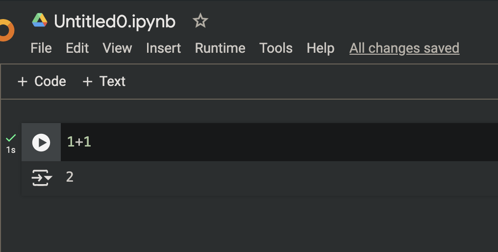
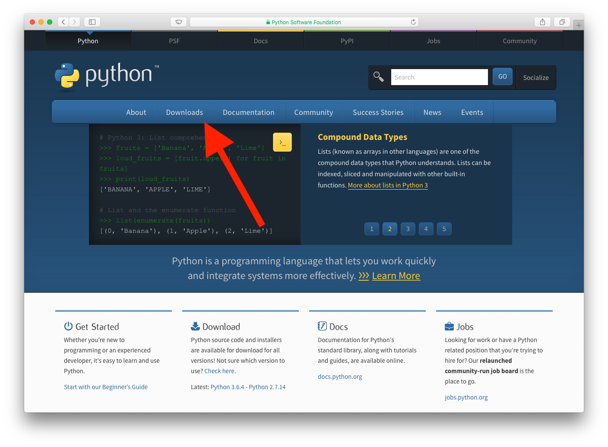
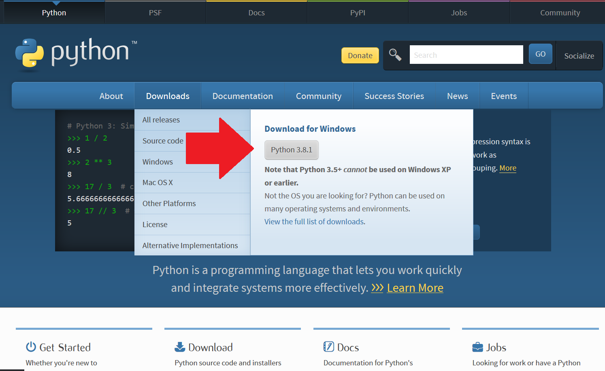
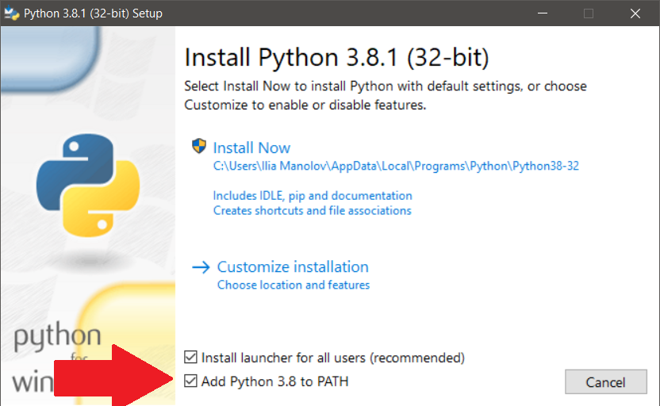
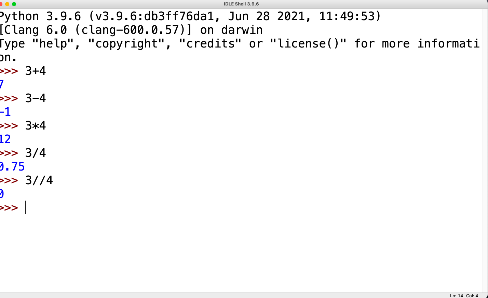
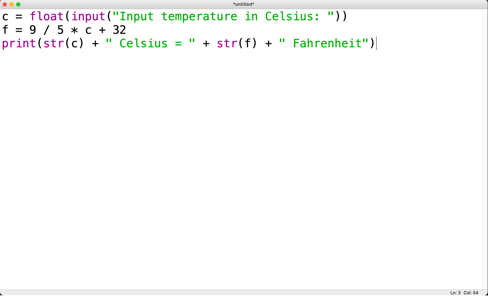
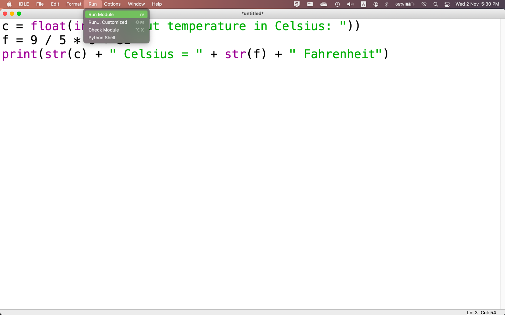
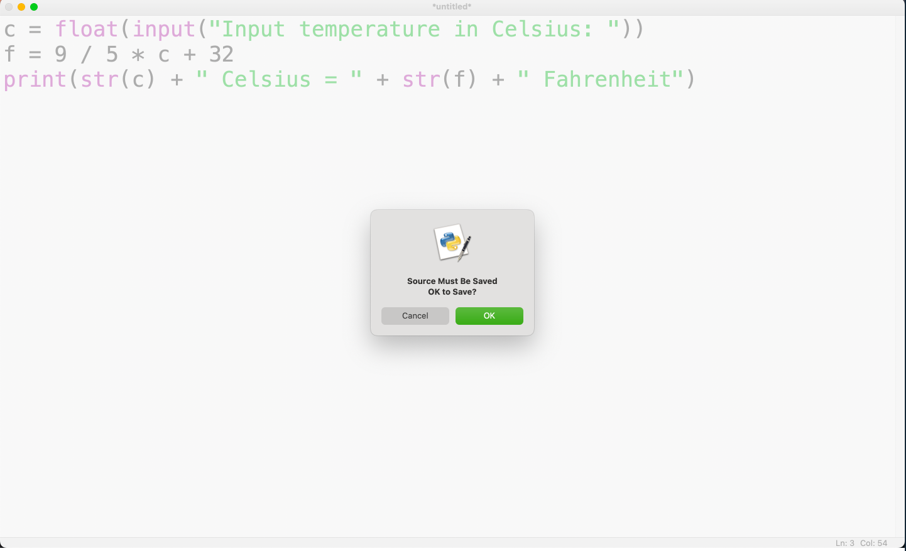
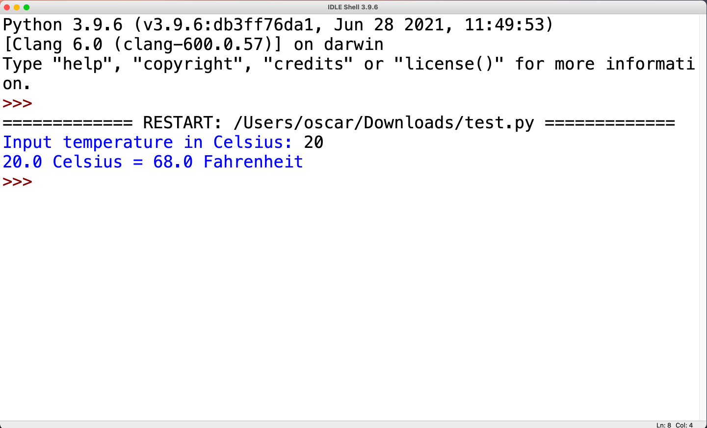

# Session 0: Setting up Python

In the [first session][session1] we'll be studying the basics of **Python**, so
it would be great if you could find a setup that works for you before the session 
starts. Learn to Code sessions are all interactive, so please bring your laptop!

[session1]: https://github.com/oxcompsoc/learntocode/tree/master/session1

## What is Python?

Python is a programming language, i.e. a text format for describing computer
programs. In order to run a program written in Python on your computer you need
to install the Python *interpreter*, which is a piece of software that takes the
code that you've written, interprets its meaning, and then runs it in your
computer. We'll use "Python" to refer to both the language and the interpreter.

## Where to get Python

Python can be downloaded to your computer, where you can then run it. This is the 
preferred way of running Python. But if you're here trying your hand at 
programming for the first time, we recommend using online services, since Python
installation (and uninstallation, if it comes to that) can be finicky. In our 
experience, these two websites have been quite good:
- [Google Colab Notebooks][https://colab.google] (these save to your Google Drive)
- [Replit][http://repl.it/languages/python3] (this service seems to have been getting worse lately)

[How to use Colab](#how-to-use-colab)
[How to use Replit](#how-to-use-replit)
[How to download](#how-to-install-python)

Prior to 2024, the official recommendation was to set up Python by downloading it.
(Hence why the instructions in that section are so detailed.)
However, since the target audience for this course has changed, Colab is probably 
your best bet.

## How to use Colab

Google Colab, as the site will tell you, is a powerful out-of-the-box computer
that's suited for running piles and piles of machine learning computations on 
Google's servers.

It's also suited to education. Lucky us!

On the main page, simply press "New Notebook" to enter a new notebook.
The contents of a notebook can be separated into two main categories: 
code and text. We'll can put our Python in the code-type blocks, and use the
text-type blocks to add context, comments, and explanations.

To run a code block, press the play button to its left.

Note: Colab is _slightly_ more generous with its output than normal. 
For instance, this code would result in an empty output in Replit, 
but gives us an answer in Colab:

Why this is will be explained in the first session.

## How to use Replit

Once you jump through all the signup hoops for Replit, you'll be greeted with a 
page that looks like this:

Press "Create Repl" to open a workspace. From here you can type your Python 
code in the center block, then press the green "Run" button to run it.

## How to install Python

**Important warning:** there are lots of versions of Python available! We will
be using **Python 3.12.6** in this course, but so long as you've got Python 3 or
higher you should be OK.

1. Go to [**https://python.org**][python]
2. On the menu at the top, click **Downloads**

    

3. Download **Python 3.12.6** for the operating system you're using (Windows shown below)
    * Windows users might need to have administrative rights
    * Linux users should already have Python installed, but please ensure that
      you have Python 3 installed
    * If you get stuck please Google "how to install Python on X" (where X is
      your operating system)

    

### !!! IMPORTANT FOR WINDOWS USERS !!!

During the installation there is an option that we'll need that isn't enabled by default - **Add Python 3.12 to PATH** (as shown below). Make sure to leave this **CHECKED** otherwise you won't be able to install the modules we'll use in the following lectures.

After installing Python all the tools you need to run Python programs will be on
your computer. There are multiple things installed for you by Python. But we are only going to use **IDLE** for writing and running Python
programs. To launch IDLE

* On Windows: Start &rarr; All programs &rarr; Python 3.10 &rarr; IDLE *or*
  Start &rarr; type `IDLE`
* On Mac: open Finder &rarr; Applications &rarr; Python 3.10 &rarr; IDLE *or*
  &#8984; + space and type `IDLE`

### Interactive Version
Once you opened the IDLE, you will be greeted with the interactive version of Python. This is where Python will execute your code and give you the results line by line. It can be used for experimenting tiny bits of code but not generally useful for writing large programs.

### Text editor version

Instead, what we would usually do is to open a new file by clicking on `File` on the top-left corner, then click `New File`.

A new empty file is then created and now we can write our code in there.

After you have written your code, you can run it by clicking on `Run` on the top-left corner, then click `Run Module`. 

It might ask you to save your code, just click yes. You can save the Python code wherever you want on the computer.

Then, your code will be run in the IDLE window. 

Note that you need to click `Run Module` everytime if you would like to run the program several more times.

That's all you need to do before the first session! If you're interested in
looking ahead to what we'll be studying, feel free to look at [notes for the first session][session1].

<!-- ## Getting to the department

Please come to Department of Computer Science, Parks Road, Oxford, OX1 3QD on
7pm Thursday 2nd week HT2020 for the first session. We expect attendance to be
high, so it will be worth arriving early!

The above map shows which entrance of the CS department you should use - there
are plenty of CompSoc signs up guiding the way. -->

[python]: https://python.org
