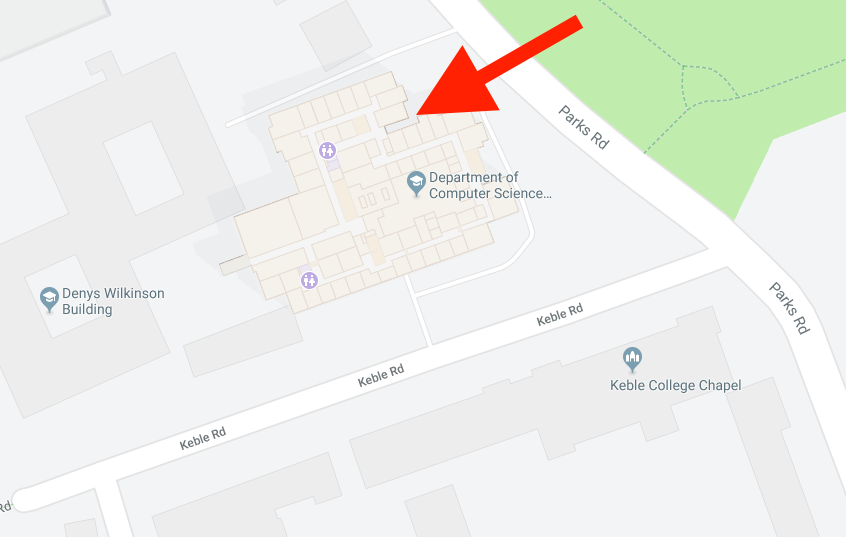

# Session 0: Installing Python

In the [first session][session1] we'll be studying the basics of **Python**, so
it would be great if you could get it installed before the session starts. Learn
to Code sessions are all interactive, so please bring your laptop!

[session1]: https://github.com/oxcompsoc/learntocode/tree/master/session1

## What is Python?

Python is a programming language, i.e. a text format for describing computer
programs. In order to run a program written in Python on your computer you need
to install the Python *interpreter*, which is a piece of software that takes the
code that you've written, interprets its meaning, and then runs it in your
computer. We'll use "Python" to refer to both the language and the interpreter.

## Installing Python

**Important warning:** there are lots of versions of Python available! We will
be using **Python 3.8.1** in this course, but so long as you've got Python 3 or
higher you should be OK.

1. Go to [**https://python.org**][python]
2. On the menu at the top, click **Downloads**

    

3. Download **Python 3.8.1** for the operating system you're using (Windows shown below)
    * Windows users might need to have administrative rights
    * Linux users should already have Python installed, but please ensure that
      you have Python 3 installed
    * If you get stuck please Google "how to install Python on X" (where X is
      your operating system)

    

## !!! IMPORTANT FOR WINDOWS USERS !!!

During the installation there is an option that we'll need that isn't enabled by default - **Add Python 3.8 to PATH** (as shown below). Make sure to leave this **CHECKED** otherwise you won't be able to install the modules we'll use in the following lectures.

## Using Python

After installing Python all the tools you need to run Python programs will be on
your computer. We're going to use **IDLE** for writing and running Python
programs. To launch IDLE

* On Windows: Start &rarr; All programs &rarr; Python 3.8 &rarr; IDLE *or*
  Start &rarr; type `IDLE`
* On Mac: open Finder &rarr; Applications &rarr; Python 3.8 &rarr; IDLE *or*
  &#8984; + space and type `IDLE`

That's all you need to do before the first session! If you're interested in
looking ahead to what we'll be studying, feel free to look at [last year's
notes][session1].

## Getting to the department

Please come to Department of Computer Science, Parks Road, Oxford, OX1 3QD on
7pm Thursday 2nd week HT2018 for the first session. We expect attendance to be
high, so it will be worth arriving early!

The above map shows which entrance of the CS department you should use - there
are plenty of CompSoc signs up guiding the way.

[python]: https://python.org
