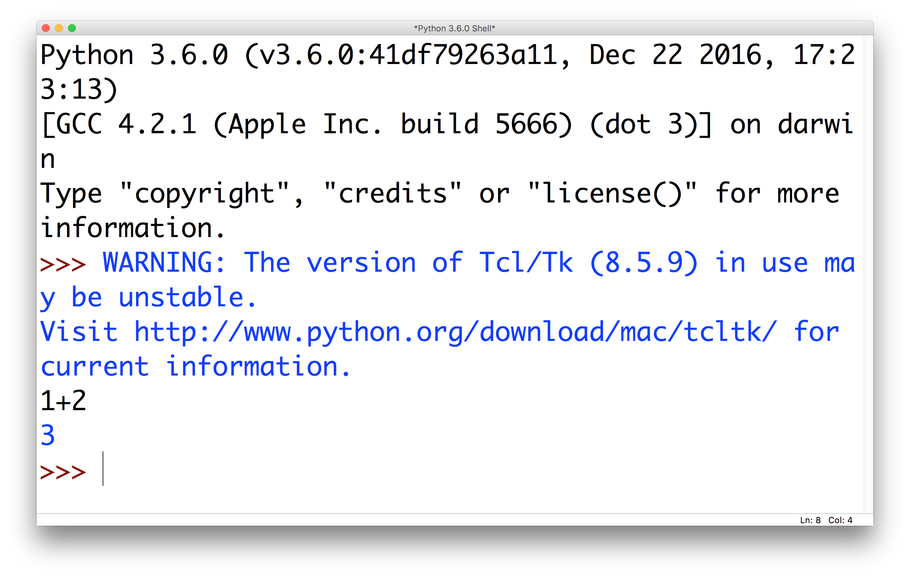

# Introduction to Python

The first thing that you’ll need to do is install Python installed on your
computer. You can find information on how to do that [here][install].

[install]: https://docs.google.com/document/d/1x41akrGAgoxWeQ9h4UJlPrxX0KaOJgvKSa2r0pgAzgM/pub

Throughout these documents note that text in a `monospaced font` is Python code.

## Information about CompSoc

The [Oxford University Computer Society][compsoc] was founded in 1978, making it
one of the oldest university computing societies in the country. Today we host
regular talks from large companies, geek nights each Saturday, and Learn to Code
each Hilary Term.

[compsoc]: https://ox.compsoc.net

## IDLE

Once you have Python installed you’ll be able to launch a piece of software
called IDLE. When you first launch it you will be greeted with a prompt where
you can type in statements or expressions in Python. In the first session we saw
that it is possible to enter simple arithmetic expressions and have them
evaluated:



(Press enter after entering an expression).

## Variables

Whilst it is useful to be able to compute expressions with values that don’t
change, we frequently want to store a value for access later on. Variables act a
little like "named boxes" where we can put a value. To assign a value to a
variable we write something like `x = 10` into IDLE, where x is the name of the
variable and 10 is the value. Then, when we want to recall the value of `x`
later on, we simply write x in an expression, e.g. `x * 2`, `x + 10`, `x / 2`,
etc.

## Strings

In addition to being able to store numbers in variables, we are also able to
pieces of text. To do this, we write `x = "hello"`. It is important to enclose
the piece of text in either single or double quote marks, and you must make sure
that they match at both ends of the text.

Strings can be concatenated together, e.g. if `x = "hello"` and `y = "thomas"`
then `x + " " + y` is `"hello thomas"`.

We can also do multiplication over strings, e.g. `"hello" * 10`.

## Functions

A function is a piece of code that is available to your program that can be
reused in different contexts. Functions are a little like sausage machines; you
can put beef in and get a beef sausage, you can put pork in and get a pork
sausage back, etc.

Some functions require you to provide **arguments** as an input to the function,
and some functions will also **return** a result back to you. We will see later
in the course how to define your own functions, but in this session we only
looked at the print and input functions. If we write `print("Hello, world!")`
then the text `"Hello world!"` will be "printed" on the screen. Alternatively,
if we write `name = input("What is your name?")` then we request show the user
the prompt, they get the chance to input some text, and that text will be
returned and assigned to the variable name.

## Writing scripts

In IDLE we can write script files, which contain a sequence of Python statements
that we can run over and over, without the need to keep typing in what we want
to do. To write a script, click File > New and enter a few statements:

```python
name = input("What is your name?")
print("Hello, " + name)
```

You then need to save the file somewhere sensible with the .py extension before
you can run it (either Run > Run Module, or F5). The program’s output will be
shown in the main Python window.

## If statements

The programs we have seen so far do approximately the same thing, so if
statements allow us to do different things based on whether certain conditions
hold. For example:

```python
name = input("What is your name?")
if name == "thomas":
    print("hey, you’re the best")
else:
    print("Shoo! Go away")
```

There are several important concepts to note here:

 * If we want to compare two values (e.g. the value the user entered and a fixed
   string) we use `==` instead of `=`
 * All the code that is directly below the if statement and has been indented
   right of it will be executed if the condition holds
 * We can add an else branch that is executed if the if statement didn’t hold
 * We can compare numbers and strings using the comparison operators `==`, `!=`,
   `<=`, `>=`, `<`, and `>`
 * If statements can be nested (we'll look at this more next week)
 * We will spend more time looking at what we can place in the condition of if
   statements next week

## Loops

**N.B.** Matt’s group had a slightly longer session this week, whereas Thomas'
group didn't get onto these. Regardless of which group you are in we’ll be doing
these next week.

A horribly inefficient way to write a program that has to do the same thing a
few times would be to copy and paste the code a few times. Instead we use loops
to allow us to run a piece of code many, or infinite times.

```python
for x in range(1, 10):
    print(x)
```

This program outputs:

```
1
2
3
4
5
6
7
8
9
10
```

## Good resources to look at

 * [Khanacademy][] - good for learning about computer science and computational
   thinking

 * [Codecademy][] - excellent introductory courses in different programming
   languages. Note that they currently use Python 2.x, whereas we are using
   Python 3.x

 * [Project Euler][euler] - programming challenges, probably a good place to
   practice after a couple of weeks

[khanacademy]: http://khanacademy.org
[codecademy]: http://codecademy.com
[euler]: http://projecteuler.net

## Challenges

These challenges are entirely optional, and you are more than welcome to do as
few or as many as you like. They are designed around the lecture material, but
will hopefully give you the chance to extend your knowledge a little further.

 * **Mixing strings and numbers:** During the sessions we only concatenated
   (i.e.  added) two strings together, but how do we add a number to a string?
   You may want to look up the str function
 * **A simple quiz game:** multiple questions, possibly multiple choice
   questions, keep track of the number of correct answers and output it at the
   end
 * **Number doubling:** Consider the following program, and correct it so that
   the number that is printed at the end is actually the number that the user
   input. How could you deal with input that is not a number?


```python
# Run this program and see what it outputs
x = input("Enter a number ")
print(x * 2)
```

 * **Number guessing game:** The program has a number, and the user has to guess
   what the number is. The program should respond whether either higher or lower
   as appropriate, or terminate if the user successfully guesses the number. Can
   you generate a random number each time the game is played? You may want to
   look up how to use random.random and while loops (covered next week)
 * **Computer number guessing game:** rather than have you guess the number,
   have the computer try and determine it instead. How can you ensure that the
   computer makes as few guesses as possible?
