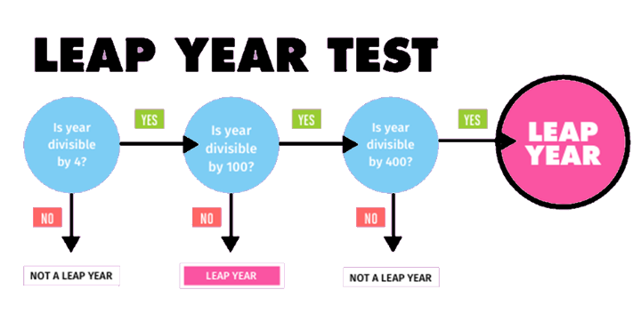

# Session 2: If statements and For loops

*Watch videos 7 and 9 of this Python tutorial playlist if you missed this session: [link][bucky]*

[bucky]: https://www.youtube.com/watch?v=HBxCHonP6Ro&list=PL6gx4Cwl9DGAcbMi1sH6oAMk4JHw91mC_&index=7
See [here][week1] for last week's content. 

[week1]: https://github.com/oxcompsoc/learntocode/tree/master/session1

## If statements

We often want our programs to adapt their behaviour based on the input they receive. For instance, lets say we want to create a program, which tells our user if the number they input is small (e.g. less than 10). This is what the next program does:

```python
number = int(input("Please enter a number: "))
if number < 10:
  print(number + " is a small number.")
```

We could also have our program say something if the number is large as well:

```python
number = int(input("Please enter a number: "))
if number < 10:
  print(number + " is a small number.")
else:
  print(number + " is a large number.")
```


We can read the above as
> if "this condition is true" then "execute this code", otherwise "execute this other code"

We can generalise the first example as:

```python
if condition_is_true:
  execute_this_code
```

And the second one as:

```python
if condition_is_true:
  execute_this_code
else:
  this_code_is_executed_otherwise
```

Notice that we write "then" as `:`. The most important thing to notice is that we execute the indented code *only* when the condition holds.

We can write any number of statements inside the **body** of the `if`
statement, i.e. statements that are indented (press `TAB`) will only be
executed if the condition of the `if` statement holds.

There are several important concepts to note here:

 * If we want to compare two values (e.g. the value the user entered and a fixed string) we use `==` instead of `=` (remember, `=` means *becomes*)
 * We can compare numbers and strings using the comparison operators `==`, `!=` (not equal), `<=` (less than or equal), `>=` (greater than or equal), `<` (less than), and `>` (greater than)
 * `if` statements can be nested

## `elif`

We can also abbreviate the following:

```python
number = int(input("Please enter a number: "))
if number < 10:
  print("This number is small.")
else:
  if number >= 10 and number < 100:
    print("This number is not small, but not large either.")
  else:
    print("This number is large.")
```

to

```python
number = int(input("Please enter a number: "))
if number < 10:
  print("This number is small.")
elif number >= 10 and number < 100:
  print("This number is not small, but not large either.")
else:
  print("This number is large.")
```

You can have as many `elif` branches as you like, but only one `if` branch and
one `else` branch, which must appear at the beginning and end respectively.

## `and` `or` `not`

Here we used the keyword `and` to mean that we want both `number >= 10` and `number < 100` to be true for that branch to be executed. You could use `or` and `not` in expressions, e.g.

```python
number = int(input("Please enter a number: "))
if not number < 10:
  # Will be executed if number is not less than 10 (i.e. if number >= 10)
  print("The number is not less than 10.")

if number == 3 or number == 4:
  # Will be executed if number is equal to 3 or equal to 4
  # Note that comparison is done with == rather than =
  print("The number is either 3 or 4.")
```
If you are using multiple different connectives, you should include parentheses to make it clear how the expression should be interpreted. E.g.

```python
number = int(input("Please enter a number: "))
if ((1 <= number and number < 10) or number == 42) and (not number == 3):
  print("This was the number: " + str(number))
```

This code will only print `number` if it is one of the numbers [1, 2, 4, 5, 6, 7, 8, 9, 42].

*Note: there is an order of operations on logical connectives as well (which you may wish to google); however, it is recommended that you insert parentheses if you are using multiple different connectives, like in the example above.*

It's important to remember that an `else` statement (or an `elif`) statement is associated with the closest `if` statement above it, which has the same indentation (same number of `TAB`s before it). So consider the program:

```python
name = input("Please enter a name: ")
if name == "Mark":
  print("Oh, hi Mark.")
if name == "Johnny":
  print("Oh, hi Johnny.")
else:
  print("Who is this?")
```

You might think that if the name input is 'Mark' it will print 'Oh, hi Mark.' if it's Johnny, it will print 'Oh, hey Johnny, what's up?', and otherwise it will print 'Who is this?'. But actually, if the name is Mark, it will print both 'Oh, hi Mark' and 'Who is this?'. This is because the `else` statement is only associated with the `if` just above it. The first `if` is completely independent. You might find it helpful to think about the program split as so:
```python
name = input("Please enter a name: ")
```
```python
if name == "Mark":
  print("Oh, hi Mark.")
```
```python
if name == "Johnny":
  print("Oh, hey Johnny, what's up?")
else:
  print("Who is this?")
```

The correct way to write the above program is using an `elif`:
```python
name = input("Please enter a name: ")
if name == "Mark":
  print("Oh, hi Mark.")
elif name == "Johnny":
  print("Oh, hey Johnny, what's up?")
else:
  print("Who is this?")
```


## Exercise

### Easy
1)  **One detector:** create a program, which takes an input (an int) and outputs "This number is 1" if the input was 1 and "This input was not 1" otherwise.

2) **Subtraction:** create a program, which takes two integers, and outputs the result of the larger number subtracting the smaller number.

  ```python
  first = ________(input("Input first number: "))
  second = ________(input("Input second number: "))
  if ________ < ________:
      #swap the two numbers
  answer = first - second
  print("The answer of "+str(first)+"-"+str(second)+" is " + str(answer))
  ```
  ```
  Samples:
  Input first number: 4
  Input second number: 3
  The answer of 4-3 is 1

  Input first number: 3
  Input second number: 4
  The answer of 4-3 is 1
  ```

### Medium

3)  **Award**: Students can only get an award if they get a score of 60 or more and get an "A" for conduct. Create a program, which takes one integer (a score) and one string (a conduct grade), and tell whether the student could get an award.

  ```
  Samples:
  Enter score: 88
  Enter conduct grade: A
  Congratulations! You get an award.

  Enter score: 88
  Enter conduct grade: B
  Your conduct grade is not A.

  Enter score: 40
  Enter conduct grade: A
  Your score is not high enough.

  Enter score: 40
  Enter conduct grade: C
  Your score is not high enough and your conduct grade is not A.
  ```
### Hard

4) **Leap Year:** a. create a program, which determines whether a year is a leap year.

  

  (*You will need to use the operator %. a % b gives the remainder when a is divided by b*)

  ```
  Samples:
  Enter year: 2022
  2022 is not a leap year

  Enter year: 2020
  2020 is a leap year

  Enter year: 2000
  2000 is a leap year

  Enter year: 1900
  1900 is not a leap year
  ```

  b. Try to achieve the same result by only using one if else block.

**You can find all the [solutions here][solutions].**

## The need for looping
Imagine you have to print a square of *s using Python.

```
**********
*        *
*        *
*        *
*        *
*        *
*        *
*        *
*        *
**********
```

One solution is to do this:

```python
print("**********")
print("*        *")
print("*        *")
print("*        *")
print("*        *")
print("*        *")
print("*        *")
print("*        *")
print("*        *")
print("**********")
```

But don't you think it is too repetitive? This is when loops come in handy. They allow you to repeatedly run the same piece of code multiple times. There are two types of loops, for and while loops.

## For loops

Runs the body a specified number of times.

For example, to print the same square as the one above, we can do:

```python
print("**********")
for i in range(8):
    print("*        *")
print("**********")
```

`range(8)` means that the statements indented will be run 8 times, in other words, 8 **iterations**. Indentation is important to specify which statements are in the for loop and which ones are not.

### What is i?

Let's try to print the value i in every iteration.

```python
for i in range(5):
    print(i)

# 0
# 1
# 2
# 3
# 4
```

The variable `i` consecutively takes all values from 0 to n-1, it helps us to keep track of our progress while looping, the following example uses the value `i` to print out the first `n` non-negative even numbers.

```python
n = int(input("Input a number: "))

for i in range(n):
    print(i*2)
```

It is common to use variable names like `i`, `j`, `k` for iteration.

It is also common for us to be wanting to iterate from 1 to n instead of from 0 to n-1. In this case, we can use `range(1,n+1)`, meaning that it will loop from 1 to n+1, including 1 but excluding n+1. That means looping from 1 to n inclusive. The following code prints out the first `n` positive even numbers. (excluding 0)

```python
n = int(input("Input a number: "))

for i in range(1,n+1):
    print(i*2)
```

### Short aside: incrementing numbers

We've seen before that we can do:
```python
number = 1
print(number + 1) # Prints '2'
print(number) # Prints '1'
```

But what if we want to actually increase the values of `number`? We might be tempted to do:
```python
number = 1
number + 1
print(number) # Still prints '1'
```
But that doesn't change `number` at all: it just asks Python to evaluate what `number + 1` is. The way to actually increment `number` is:

```python
number = 1
number = number + 1
print(number) # Prints '2'
```
This might seem a bit confusing at first, since `number` appears both on the left and on the right of the `=`. The rule in Python is that stuff on the right side of and `=` are evaluated before stuff on the left side. You can think about the above code like it was shorthand for this:

```python
number = 1
temp = number + 1
number = temp
print(number)
```

Another way to do this exact same thing is:
```python
number = 1
number += 1
print(number)
```

Here, the `+=` operator is used as a shorthand for writing `number = number + 1`. These kinds of shorthands are usually referred to as _syntactic sugar_ in programming - it's shorter so it's "sweeter" for people to read and write. There are analogous operators: `-=`, `*=`, `/=`, etc.
```python
number = 1
number += 2
number -= 3
number *= 4
number /= 5
# ...
```
If unsure, just use the first form: `number = number + 1`. 

In the specific case when we have `number += 1` (i.e. we have `1` on the right-hand side) we say that we **increment** `number`. When we do `number -= 1` we say that we **decrement** `number`.
### Worked example: summing from 1 to `n`
The following example sums the first `n` natural numbers, including `n`. 

```python
n = int(input("Please enter a number: "))

sum = 0
for i in range(1,n+1):
    sum += i

print("The sum of the first " + str(n) + " natural numbers is " + str(sum))
```

### Exercises
<!-- Will do Q1, 4, 5, 6 in lesson -->
#### Easy

5)  What are the outputs of the following program segments?

    ```python
    # a)
    for i in range(5):
	    print(i)
    ```
    ```python
    # b)
    for i in range(4,10):
	    print(i)
    ```
    ```python
    # c)
    for i in range(5):
	    print("Hello")
    ```
    ```python
    # d)
    for i in range(4,10):
	    print("Hello")
    ```

*When attempting these exercises, I suggest you type out the code by hand, rather than copy-pasting it. Pay attention to all of the symbols you are typing and see if you can recall why they are there.*

6)  Complete the program below, which outputs the first `n` powers of 2. 

    ```python
    n = ___(input("Input a number: "))
    number = 1
    for i in range(_____):
        number____________
        print(number)
    ```

    ```
    Sample: 
    Input a number: 5
    2
    4
    8
    16
    32
    ```

7)  Write a similar program, which outputs the `n`th power of 2. (should work for all n >= 0)
    ```
    Sample: 
    Input a number: 5
    2 to the power 5 is 32.
    ```

#### Medium
8)  Write a program, which asks the user for an input `n` and then for `n` numbers. Then, it prints out the average of those `n` numbers. A run of your program might look something like this:

    ```
    How many numbers? 3
    Please enter a number: 1
    Please enter a number: 3
    Please enter a number: 5
    The average was: 3.0
    ```

9)  Complete the program below, which outputs the first `n` fibonacci numbers. (Each number is the sum of the two preceding ones, starting with 0,1.)

    ```python
    t = ______(input("Input a number: "))
    a = 0
    b = 1
    for ______ in range(t):
        c = a + b # calculate new term
        #shift the terms by 1
        a = ____
        b = ____
    print("Term " + str(i) + " is " + _____________)
    ```
    ```
    Sample: 
    Input a number: 5
    Term 0 is 0
    Term 1 is 1
    Term 2 is 1
    Term 3 is 2
    Term 4 is 3
    Term 5 is 5
    ...
    Term 14 is 377 (just for checking)
    ```
#### Hard
10)  Create a program, which takes as input a number `n` and then prints the following:

  ```
  1

  1 2

  1 2 3

  .............

  1 2 3 4 ... n
  ```
  *Hint: If you want to print something without a newline at the end, the way to to that is:*

  ```python
  number = 10
  print(number, end=" ") # This will print " " after number.
  ```

11)  a)  Create a program, which prints a square of *s of size `n` based on input. As a generalisation of the example. 
  
  Sample:

  ```
  Input side length of the square: 10
  **********
  *        *
  *        *
  *        *
  *        *
  *        *
  *        *
  *        *
  *        *
  **********
  ```

  b)  Try not to use string "multiplication" and string "addition".

  c)  Try modifying your program so that it only outputs 1 star when n is 1, and no stars when n <= 0

**You can find all the [solutions here][solutions].**

[solutions]: https://github.com/oxcompsoc/learntocode/tree/master/session2/src