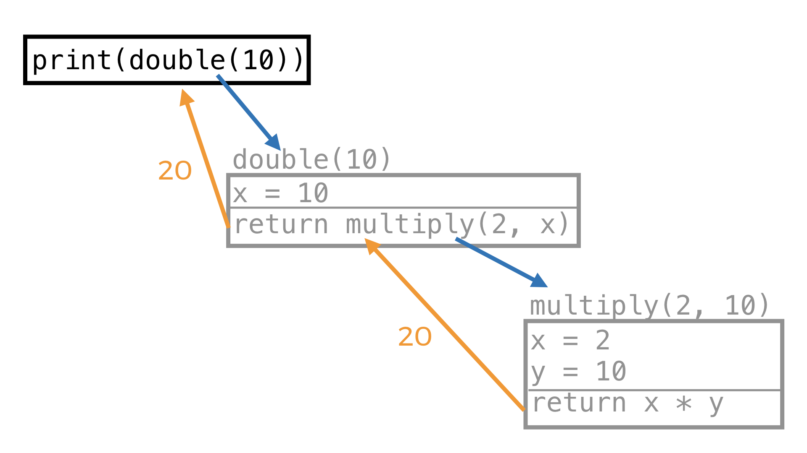

# Session 2: Functions, while loops

See [here][week1] for last week's content. 

*For a very brief summary of the content covered in this session, click [here](#summary).*


[week1]: https://github.com/oxcompsoc/learntocode/tree/master/session1

## Recap

In the previous session we used these concepts:
```python
# Any text after a '#' symbol on a line is a comment. It is not part of the code.

print("Hello, world!") # This is how we print.

message = "Hi!" # This is how we create variables.
print("The value of the variable is: " + message) # This is how we join strings.

name = input("Please enter you name: ") # This is how we ask for string inputs from our user.
number = int(input("Please enter a number: ")) # This is how we ask for int inputs.
# (Remember: ints are whole numbers [..., -2, -1, 0, 1, 2, ...])

print("The number times two is: " + str(number * 2)) # This is how we join strings with numbers.

# An if statement. Note the : and the == which is how we compare values for equality.
if number == 0:
  print("The number is zero.")
elif number >= 0 and number <= 9:
  print("The number is a positive single digit integer.")
elif number < 0:
  print("The number is negative.")
else:
  print("The number is larger than 10.")
```

## While loops

Imagine we wanted to create a simple security program, which asks our user for a password, until they enter the correct one. One way to do this is:

```python
SECRET_PASSWORD = "hunter2"

user_input = input("Please enter a password: ")

while user_input != SECRET_PASSWORD:
  print("Access denied: wrong password.")
  print() # Print a newline. This is just here to make things look nicer.
  user_input = input("Please enter the password: ")

print("Access granted.")
```

This program will continue prompting the user for a password until they input the correct password, which is "hunter2". One way to think about the above code is like this **(Note: this is NOT actual Python code)**:

```python
SECRET_PASSWORD = "hunter2"

user_input = input("Please enter a password: ")

<START OF WHILE LOOP>
if user_input != SECRET_PASSWORD:
  print("Access denied: wrong password.")
  print() # Print a newline. This is just here to make things look nicer.
  user_input = input("Please enter the password: ")
  GOTO: <START OF WHILE LOOP>

print("Access granted.")
```

Here, `<START OF WHILE LOOP>` is just there to label that line. Then the `GOTO` says that the program should start executing that line again.

So back to the actual code. The idea with the while loop is very simple: the code in the body of the loop will be executed repeatedly, while the condition remains true; otherwise said: until the condition becomes false. In this case, while the user keeps entering the wrong password, the program will keep prompting them for a new one.

Now, if the user enters the correct password on their first try, the body of the loop will not be executed.

## Short aside: incrementing numbers

We've seen before that we can do:
```python
number = 1
print(number + 1) # Prints '2'
print(number) # Prints '1'
```

But what if we want to actually increase the values of `number`? We might be tempted to do:
```python
number = 1
number + 1
print(number) # Still prints '1'
```
But that doesn't change `number` at all: it just asks Python to evaluate what `number + 1` is. The way to actually increment `number` is:

```python
number = 1
number = number + 1
print(number) # Prints '2'
```
This might seem a bit confusing at first, since `number` appears both on the left and on the right of the `=`. The rule in Python is that stuff on the right side of and `=` are evaluated before stuff on the left side. You can think about the above code like it was shorthand for this:

```python
number = 1
temp = number + 1
number = temp
print(number)
```

Another way to do this exact same thing is:
```python
number = 1
number += 1
print(number)
```

Here, the `+=` operator is used as a shorthand for writing `number = number + 1`. These kinds of shorthands are usually referred to as _syntactic sugar_ in programming - it's shorter so it's "sweeter" for people to read and write. There are analogous operators: `-=`, `*=`, `/=`, etc.
```python
number = 1
number += 2
number -= 3
number *= 4
number /= 5
# ...
```
If unsure, just use the first form: `number = number + 1`. 

In the specific case when we have `number += 1` (i.e. we have `1` on the right-hand side) we say that we **increment** `number`. When we do `number -= 1` we say that we **decrement** `number`.

## Back to while loops

Let's see some more examples. Here is how we print the first n natural numbers:
```python
n = int(input("Please enter a number: "))

i = 1
while i <= n:
  print(i)
  i += 1 # Increment i (i becomes bigger by 1).
```

This is a very common paradigm in all of programming. It is called **iterating** over a range. This is because, within the while loop, the variable `i` consecutively takes all values from 1 to n. It is almost ubiquitous to use variable names like `i`, `j`, `k` for iteration.

Here is how we calculate the sum of the first n natural numbers:
```python
n = int(input("Please enter a number: "))

i = 1
sum = 0
while i <= n:
  sum += i
  i += 1

print("The sum of the first " + str(n) + " natural numbers is " + str(sum))
```

A common pitfall is to forget to increment. Here is how we **don't** calculate the sum of the first n natural numbers:

```python
n = int(input("Please enter a number: "))

i = 1
sum = 0
while i <= n:
  sum += i

print("The sum of the first " + str(n) + " natural numbers is " + str(sum))
```

If that looks like the same code to you, don't worry; even experienced programmers often make this simple mistake. The issue is that we don't increment `i` within the body of the loop. So every time we pass through the loop, `i` remains `1`. If `n` is more than `2`, then this loop will go on forever. **This is a very common mistake. Always keep this in mind if your program seems to "hang".**

## Exercises:

*When attempting these exercises, I suggest you type out the code by hand, rather than copy-pasting it. Pay attention to all of the symbols you are typing and see if you can recall why they are there.*

### Easy:
* 1: Create a program that asks the user to input a number `n`, and then prints the first `n` natural numbers in reverse order. E.g. if `n` is 4, your program should print: '4 3 2 1', each number being on a new line. (*Hint: model your program after one of the programs we already wrote.*)
* 2: Complete the program below, which asks the user to input a number `n` and then prints the product of the first `n` natural numbers. E.g. if the input is 4, your program should calculate 1 * 2 * 3 * 4 and print the result.
  ```python
  n = int(input("Please enter a number: "))

  product = 1
  i = 1
  while # Complete the rest.
    # ...
  
  print(product)
  ```

### Medium:
* 3: Create a program, which repeatedly asks the user to input a number, until their number is greater than 9. A run of your program might look like:
  ```
  Please enter a number: 5
  That number is too small!
  Please enter a number: 9
  That number is too small!
  Please enter a number: 10
  That's a good number!
  ``` 
* 4: Create a program, which continuously prompts the user to input a first name and a last name, until the names they enter match yours.

### Hard:

* 5: (Math) Write a program, which asks the user for an input `n` and then for `n` numbers. Then, it prints out the average of those `n` numbers. A run of your program might look something like this:

  ```
  How many numbers: 3
  Please enter a number: 1
  Please enter a number: 3
  Please enter a number: 5
  The average was: 3.0
  ```
### Expert:
* 6: Create a program, which takes as input a number `n` and then prints the following:

    1

    1 2

    1 2 3

    .............

    1 2 3 4 ... n
  
  *Hint: If you want to print something without a newline at the end, the way to to that is:*
  ```python
  number = 10
  print(number, end=" ") # This will print " " after number.
  ```

## Lists

Suppose we wanted to create a shopping list app. We would like to be able to store our user's shopping list and retrieve the items from it on demand. This is where Python lists come in. Here is how we create a list:

```python
shopping_list = ["bread", "smoked salmon", "cherry tomatoes", "cream cheese"]
```

In Python, we can also `print` the whole list, to view all the items:

```python
shopping_list = ["bread", "smoked salmon", "cherry tomatoes", "cream cheese"]
print(shopping_list)
```

Or we can access the items one by one:

```python
shopping_list = ["bread", "smoked salmon", "cherry tomatoes", "cream cheese"]
print(shopping_list[0]) # Prints 'bread'
print(shopping_list[1]) # Prints 'smoked salmon'
print(shopping_list[2]) # Prints 'cherry tomatoes'
print(shopping_list[3]) # Prints 'cream cheese'
```

As we can see, a list is an numbered collection of items. An important thing to remember is that in Python **indexing starts at 0**. What that means is that the first item is *at* **index** 0, the second item is at index 1, etc. We access the item at index `i` (where `i` is an integer) by writing `shopping_list[i]` - the name of the list, and then the index in square brackets. 

Now what would happen if we try to access the item at index 4 of our shopping list? Let's try:

```python
shopping_list = ["bread", "smoked salmon", "cherry tomatoes", "cream cheese"]
print(shopping_list[4]) # ERROR: list index out of range 
```

If you run this code, you would get something called an index error. This is because there is no item at index 4. Note now, that the list has 4 items, but the highest index is 3. In general, a list with `n` items will have a highest index of `n-1`. 

We can get the *length* of the list (i.e. the number of items in it), by calling the `len` function:

```python
shopping_list = ["bread", "smoked salmon", "cherry tomatoes", "cream cheese"]
length = len(shopping_list)
print("The length of the list is: " + str(length))
```

Note that the `len` function returns an `int`, so we need to convert that to a `str` before printing.


## Exercises

### Easy:
* 7: Create a list of 3 cities you want to visit. Print the whole list on one line. Print the list item by item. Print the length of the list.

### Medium:

* 8: Complete the program so that it prints the contents of the shopping list:

  ```python
  shopping_list = ["bread", "smoked salmon", "cherry tomatoes", "cream cheese"]

  i = 0
  length = len(shopping_list)
  while i < length:
    # Complete this code
  ```

### Hard:
* 9: Complete the program so that it prompts the user to input a number `n`, then prints `shopping_list`, item by item, `n` times in a row:
  
  ```python
  shopping_list = ["bread", "smoked salmon", "cherry tomatoes", "cream cheese"]
  n = # Complete the rest of the program
  # ...
  ```
  A run of your program might look like:
  ```
  Please enter a number: 2
  bread
  smoked salmon
  cherry tomatoes
  cream cheese
  bread
  smoked salmon
  cherry tomatoes
  cream cheese
  ```

### Expert:
* 10: Make your own shopping list program! Begin by prompting a user to enter the number of things they want on their list and then ask them for each separate item. The program should output the items on the list in the same order, each on a separate line, after the user's done with their input.

  Here's a sample run:
  ```
  Welcome to the shopping list app!
  Please enter the size of your shopping list: 3
  Please enter item number 1: bread
  Please enter item number 2: smoked salmon
  Please enter item number 3: cherry tomatoes
  Your shopping list is:
  bread
  smoked salmon
  cherry tomatoes
  ```
  *Hint: the next few lines might be helpful:*

  ```python
  my_list = [] # This is how we create an empty list. I.e. a list with no items
  my_list.append("item1") # This is how we append to the back of our list
  my_list.append("item2") # And again
  print(my_list) # Prints '["item1", "item2"]'
  print(len(my_list)) # Prints '2'
  ```
* 11: Do you really need to enter the number n in the beginning? Wouldn't it be more convenient for a user to tell when the shopping list _ends_ instead? Make a program that does just that. Here's a sample run:

  ```
  Welcome to the shopping list app!
  Please enter item number 1: bread
  Please enter item number 2: smoked salmon
  Please enter item number 3: cherry tomatoes
  Please enter item number 4: end
  Your shopping list is:
  bread
  smoked salmon
  cherry tomatoes
  ```
<!---
## Functions

Last time we saw this example:

```python
name = input("Please enter your name: ")
print("Hi, " + name + "!")
```

Now, if we only had to say hi to one person, this would be fine. But if we want to do this multiple times, writing out `"Hi, " + name + "!"` each time might get laborious. The way we solve this is by using functions:

```python
def say_hi(name):
  print("Hi, " + name + "!")

name_of_person = input("Please enter your name: ")
say_hi(name_of_person)
```
If we run this program, we will see that it does exactly the same thing as before. However, instead of writing out the whole print statement each time, we could now do:

```python
say_hi("Mark") # Prints 'Hi, Mark!'
say_hi("Johnny") # Prints 'Hi, Johnny!'
# etc.
```

If we wanted to, we could put the entire first program in a function:
```python
def hi_sequence():
  name = input("Please enter your name: ")
  print("Hi, " + name + "!")

hi_sequence()
```
Again, this is exactly the same as the first program. However, now we can ask for a name multiple times by *calling* the `hi_sequence` function again and again.

So a **function** is a kind of like a mini-program, which we can execute as many time as we like within our big program. Each time we execute this mini-program, we say that we **call** the function.


Here are a few more examples of functions (each function occupies it's own square):

```python
def double(number):
  return number * 2
```
```python
def multiply(number1, number2):
  return number1 * number2
```
```python
def print_whatever():
  print("Whatever.")
```
```python
my_number = 10
print(double(my_number)) # Prints 20
print(multiply(my_number, 3)) # Prints 30
```
A few key points:

  * We use the `def` keyword to tell Python that we are defining a function.
  * After def we write the *name* of the function. The possible names for functions are the same as for variables.
  * After the name, in parentheses, we write what *arguments* the function will **take**. If the function takes no arguments, we must write an empty set of parentheses.
  * We write a `:` to indicate that what follows is the *body* of the function. The code that follows should be *indented* (1 `TAB` character), to indicate that it is part of the *body* of the function. The function ends when the first line with less indention is met. (This is very similar to what we had with `if` statements.)
  * If we wish to pass something back to our program, we use the `return` keyword

Now, let's go back to the `say_hi` function:

```python
def say_hi(name):
  print("Hi, " + name + "!")

say_hi("Mark")
```

When we *call* `say_hi` with argument `"Mark"`, Python essentially creates a new program, that looks something like this:

```python
name = "Mark"
print("Hi, " + name + "!")
```

Here, `name` is called a **local** variable. This is because it only exists within that function call (we say that `name` only exists within the **scope** of the function). Here is an example how things can go wrong:

```python
def say_hi(name):
  print("Hi, " + name + "!")

say_hi("Mark")
print(name) # ERROR: name is not a global variable!
```

Variables declared outside of any function are called **global** variables.
Functions are aware of global variables:

```python
def say_hi():
  print("Hi, " + name + "!") # Prints 'Mark'

name = "Mark"
say_hi()
```

Now, we could also rewrite our program as:

```python
def say_hi(name):
  print("Hi, " + name + "!")

name = input("Please enter your name: ")
say_hi(name)
```
When we do this, we should always keep in mind that the local variable `name` inside the `say_hi` function is completely different from the global variable `name`. To emphasize this we can also look at this example:

```python
def change_name(name):
  name = "Peter"
  print(name) # Prints 'Peter'

name = "Mark"
change_name(name)
print(name) # Prints 'Mark'
```

This illustrates that the name inside the function is a variable, so in particular, we can change it. Additionally, changing the variable inside the function does not change the variable we used outside - they are different variables!

You can think about it in this way: when a function sees a *name* (of a variable), it will first check if there is a **local** variable with that name, and use that one. Otherwise, it will check if there is a **global** variable with that name, and use that one. If there is no such variables, we will get an error.

Functions can also create their own variables, which aren't arguments:

```python
def print_whatever():
  message = "Whatever."
  print(message) # Prints 'Whatever.

print_whatever() # This is fine.
print(message) # ERROR: message is not a global variable.
```

Now, lets examine the `double` function:

```python
def multiply(number):
  return number * 2

print(double(10)) # Prints '20'
```

What the `return` keyword means is that the value after it is passed back to the part of the code that called it (in this case, to the print statement).

Functions can also call other functions. For example:

```python
def multiply(x, y):
    return x * y

def double(x):
    return multiply(2, x)

print(double(10))
```

When executed, this is what the code will do:



Again, each function call creates its own scope. So the local variable `x` inside `double` is different from the local variable `x` inside `multiply`.

## Exercises:

*When attempting these exercises, I suggest you type out the code by hand, rather than copy-pasting it. Pay attention to all of the symbols you are typing and see if you can recall why they are there.*
### Easy:
* 1: Complete the body of the function `my_function`, so that when you run the program below, it prints "This is my first function!".
  ```python
  def my_function():
    # Complete this line.

  my_function()    
  ```
* 2: Create the body of the function `average`, so that when you run the program below prints the average of the two input numbers.
  ```python
  def average(number1, number2):
    return # Complete this line.

  first_number = int(input("Please enter a number: "))
  second_number = int(input("Please enter a number: "))
  print(average(first_number, second_number))
  ```
  
### Medium:
* 3: Complete the program below by adding a function `is_this_me`, which takes an argument `name`, and prints "Yes!" if `name` is your name, and "No!" otherwise. *Hint: you might find it helpful to look at the recap on if statements.*

  ```python
  # Your function goes here.

  name = input("Please enter a name: ")
  is_this_me(name)
  ```

### Hard:
* 4: Create a function `perform_operation`, which takes three arguments: two numbers, `number1` and `number2`, and one string, `operation`. If `operation` is one of "add", "subtract", "multiply", "divide", your program should return the result of performing that operation on `number1` and `number2` (e.g. if it is "subtract", return `number1` - `number2`). If it is neither, it should print "Unknown operation." and return 0.
* 4.1: Now write a program to test your function. Try printing the results of calling your function with some arguments, e.g. `perform_operation(1, 2, "add")`.
--->

## Summary
```python
number = 10
number += 1 # Incrementing a number.
number -= 1 # Decrementing a number.

# Printing the first n natural numbers:
n = int(input("Please enter a number: "))
i = 1
while i <= n:
  print(i)
  i += 1 # Increment i (i becomes bigger by 1).

# Lists:
shopping_list = ["bread", "smoked salmon", "cherry tomatoes", "cream cheese"]
print(shopping_list[0]) # Prints 'bread'
print(shopping_list[1]) # Prints 'smoked salmon'
print("Length of shopping list: " + str(len(shopping_list))) # Length of the list
```


<!---
## Recap from Session 1

In the previous session we used these concepts:
```python
# Any text after a '#' symbol on a line is a comment. It is not part of the code.

print("Hello, world!") # This is how we print.

message = "Hi!" # This is how we create variables.
print("The value of the variable is: " + message) # This is how we join strings.

name = input("Please enter you name: ") # This is how we ask for string inputs from our user.
number = int(input("Please enter a number: ")) # This is how we ask for int inputs.
# (Remember: ints are whole numbers [..., -2, -1, 0, 1, 2, ...])

print("The number times two is: " + str(number * 2)) # This is how we join strings with numbers.

# An if statement. Note the : and the == which is how we compare values for equality.
if number == 0:
  print("The number is zero.")
elif number >= 0 and number <= 9:
  print("The number is a positive single digit integer.")
elif number < 0:
  print("The number is negative.")
else:
  print("The number is larger than 10.")
```
--->