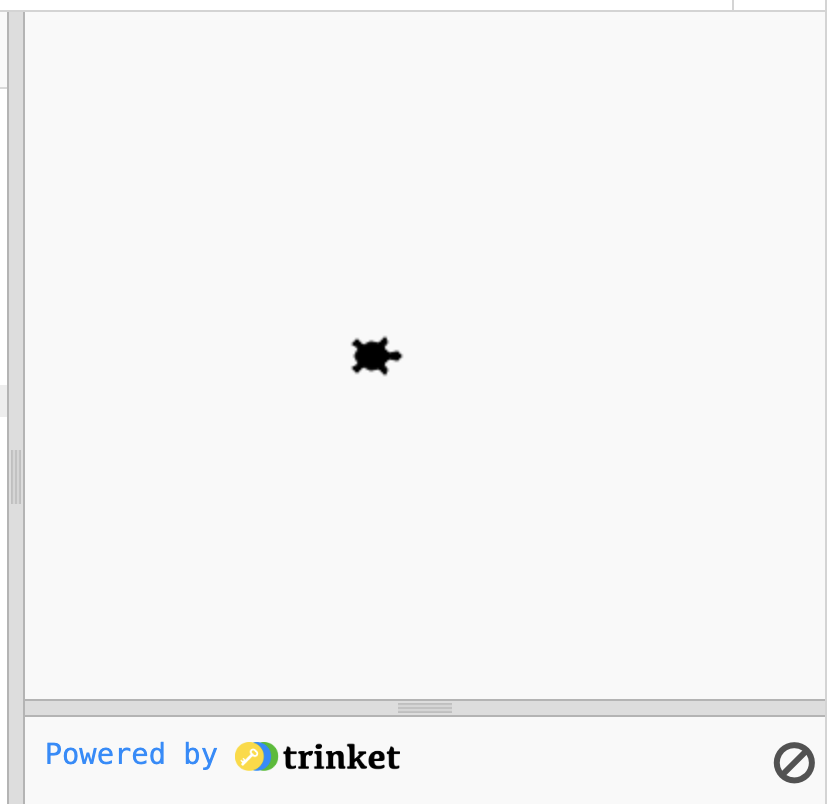
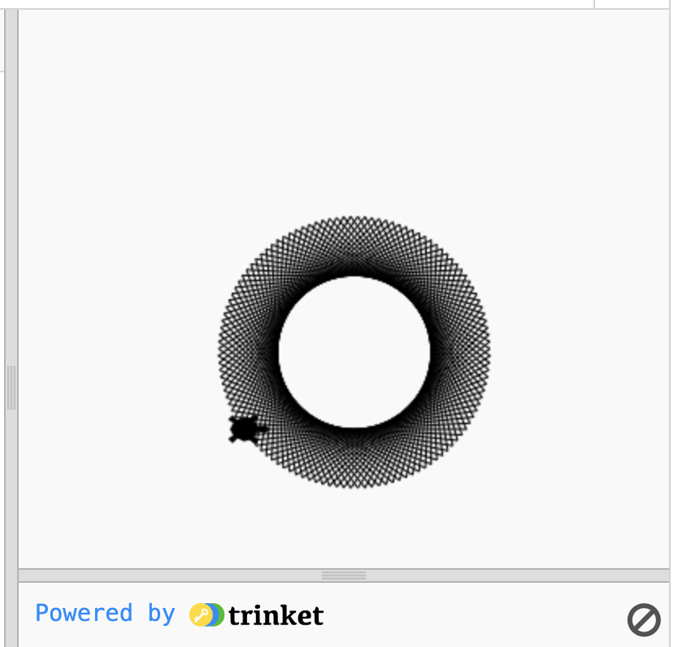
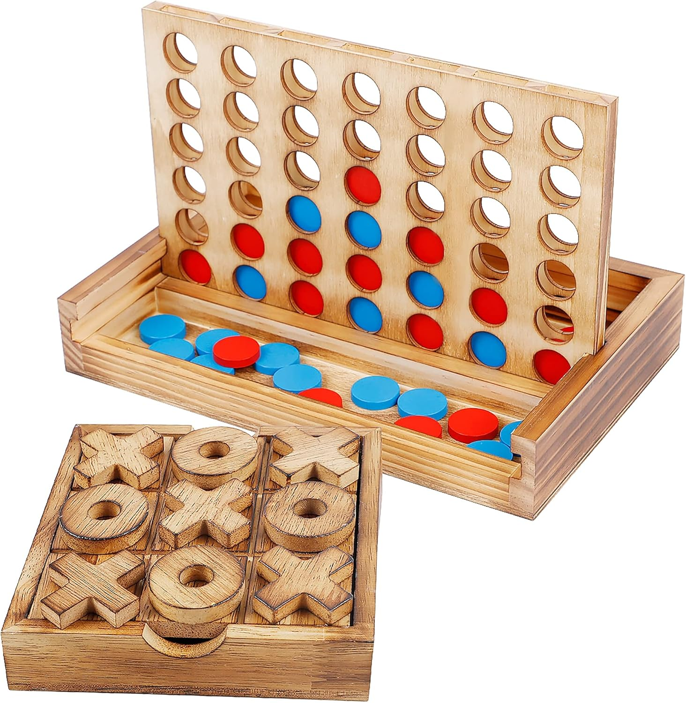

# Session 6: Turtle Graphics

We've been working a lot with text input and text output, but modern Python is used for processing all sorts of things. In machine learning, for instance, it's pretty standard to see Python code where you:
- feed the code 1000 GB of images, 
- let Python write some numbers to a file, 
- and get shown a graph.

Today we're taking our first step into showing the user more than just text with the beginner's drawing library: Turtle Graphics.

<!-- Explain what a library is at this point -->

# Turtle Graphics
Our recommended Python environments (Notebook and Replit) don't support Turtle Graphics, so if you don't have Python installed to your computer, we recommend using [Trinket](https://trinket.io/turtle) today.

A Turtle is like the tip of a pen. You can give it commands to raise it off the page, put it down on the page, change its color and its position, etc.

We create a Turtle by using
```python
import turtle

turtle_name = turtle.Turtle()
```
In the above code, we're telling Python to load the functions defined by the `turtle` library. Then, in the function call, the `turtle.` part tells Python that we want to use a function from the `turtle` library. Then, the `Turtle()` part identifies and calls the function.

Python naming conventions: **Capitalized functions** like `Turtle` tend to be **constructors**, meaning their purpose is to initialize an object - in this case, a new Turtle. The constructor then returns the new Turtle, so we save it in a variable.



(If you can't see the turtle, try setting it's `shape` by using `turtle_name.shape('turtle')`.)

## Drawing Patterns

We'll mainly be using the following functions. Don't worry about memorizing them all right off the bat! If you need something more, feel free to look for the Turtle Graphics documentation online.

| Name      | Effect                          |
|-----------|---------------------------------|
| penup()   | Lifts pen (stops drawing).      |
| pendown() | Puts pen down (starts drawing). |
| move(x,y) | Moves the turtle to (x,y).      |
| color(s)  | Changes pen color. *            |
| forward(d)   | Moves the turtle forward by d units.         |
| right(d)     | Turns the turtle right by d degrees.         |
| begin_fill() | Begins filling the outline the turtle draws. |
| end_fill()   | Ends filling the outline the turtle draws.   |

<sup>* s can be an rgb tuple e.g. (255,4,20) or a string e.g. "red".</sup>

Here's an example of drawing a pattern with a turtle.
```python
koopa = turtle.Turtle()
koopa.shape("turtle") # What does this code do?
koopa.speed(200)      # What does this code do?

origin = (-40, -100)
koopa.penup()
koopa.goto(origin)
koopa.pendown()

koopa.forward(160)
koopa.left(111)
while(koopa.distance(origin) > 1):
    koopa.forward(160)
    koopa.left(111)
```



### Exercise 1. (Open Ended)
Create a line pattern or shape you find nice to look at!
(Optional: Send it to me so I can put it on the notes for next year :D)

### Exercise 2.
Use the `grad` function to add a rainbow color to your pattern.

```python
# grad is a useful function,
# but also a useful example of why we need to document our code,
# because it's hard to read, and thus would be hard to maintain,
# if I didn't also write the documentation!


""" 
The grad function takes a real number between 0 and 1
and returns a triple of values (r, g, b)
that represents walking along the rainbow by that distance, 
where 1 is a full cycle: grad(0) = grad(1) = red.

Example usage:
for i in range(0,100):
  koopa.color(grad(i / 100))
  koopa.circle(100 - i)

:param i: how far along the rainbow to walk. 
:returns: a tuple (r,g,b).
"""
def grad(i):
  r = 6 * i
  a = min(r % 2, 1)
  d = min(1, 2 - r % 2)
  ius = [255 * d, 255 * a, 0]
  for _ in range(int(r // 2)):
    ius.insert(0, ius.pop())
  return tuple(ius)
```

### Extension A. (Very Hard) (Open Ended)
Write your own gradient function that takes a number from 0 to 1 and returns a color in RGB format `(r,g,b)` or hexstring format `"#12345F"`. For instance, you could slide up the shades of blue by returning `(0, 0, 255 * input_value)`.

When you find a gradient function you like, apply it to your pattern - and send the result to me!

## Drawing Games
Turtle Graphics is very good at patterns, but we can also use it to draw other things. For instance, any game where you start with a board and draw things onto it, we can now create. 

In particular, since Turtle gives us a pen, we can now create just about every paper-and-pencil game, including:

- Mastermind
- Dots and Boxes
- Hangman
<!-- - Connect Four
- Five in a Row -->

Let's try to create a game of Tic-Tac-Toe. First step, breaking down the problem: what are the smallest steps involved in a game of Tic-Tac-Toe?

1. Draw the board,
2. Alternate between players until one of them wins,
3. Current player inputs a square,
4. We check if that square is empty, and if not, keep asking the player for squares,
5. Draw either an X or an O in the square according to which player just played,
6. Check to see if that player won. If so, end the game.

This breakdown of a high-level task into lots of small steps that are easy to individually turn into code is called **pseudocode**, and it's always helpful to have that outline planned before you start writing your actual code.


## Exercise 3.
Write out the pseudocode for a game of Connect Four. This is fairly open-ended, but since the end result should still be Connect Four, I haven't tagged it as (Open Ended).



(This image is so perfect for this session and also so unlicensed)

The rest of the session will be spent finishing the code in [tictactoe.py](tictactoe.py). Good luck!