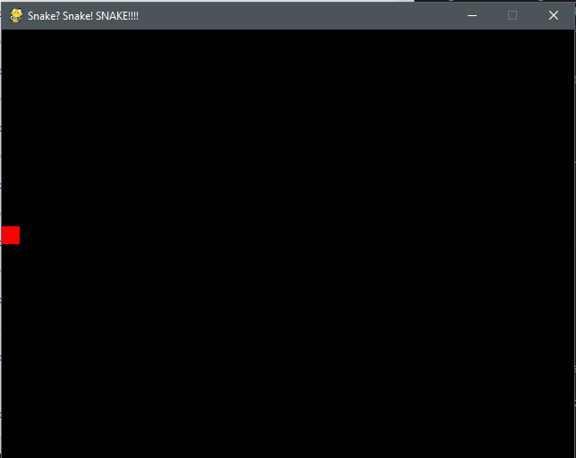
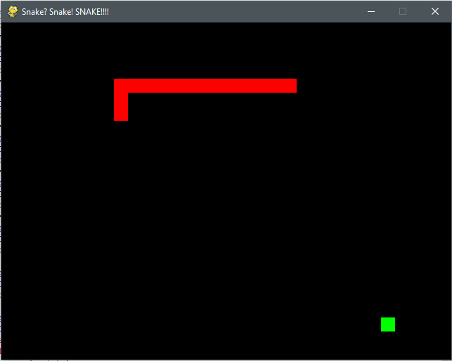

# Session 6: Snake? SNAKE? SNAAAAAAAAAAAAAKE!

You can find the resources for last week's session [here](https://github.com/oxcompsoc/learntocode/tree/master/session5).

In this week's session we'll be coding the classic Snake game from the old Nokia phones in Python. For this we will need a bit of a setup:

##IMPORTANT: Please try to install PyGame before or at the start of the lecture. The instructions to do so are [here](https://www.pygame.org/wiki/GettingStarted). If you have a Mac or Linux it shouldn't be a problem to install it with `pip`. If you're running Windows and have not added Python to PATH when installing it, please consult one of the helpers.

######If you can't install Pygame for whatever reason then you can use [this tool](https://trinket.io/features/pygame). Please understand that its code is running on a webserver so if too many people decide to use it it might not be able to keep up.

Great, now that we have PyGame installed, feel free to download the base code from the GitHub repository. We will be using it as a starting point from which we can build up our game.

Here's a comparison between the base and the completed game:

## The game loop

Every video game is essentially one big loop doing 3 main functions over and over while the game is running:
 - handling of events: This part of the loop makes sure that if you press a key on the keyboard, tap the screen, or do any similar action it gets recorded and dealt with properly. In our Snake game we want this part of the code to record the left and right arrow keys to signal that the snake has changed direction and the escape key to signal if the user wants to exit.
 - updating the game state: This is where the game logic takes place. In our game this is where we'll move the snake, check if it's bitten itself, check if it's eaten a fruit, etc. There's an important distinction between this and the last function which we'll make when we get to the code.
 - drawing: This is where the game takes everything it's calculated and puts it onto the screen.

Since monitors refresh 60 times a second we'll try to get our loop to loop once every 60 seconds. That means that if we don't wait around we'll have a game that runs too quickly. There are games that let you run at whatever framerate you'd like but for simplicity's sake, we'll assume that the game can always do 60 frames per second and have it wait around if it's going too fast. The developers of PyGame have thought this through and have created `clock`s that let us wait for the next frame.

Have a look at the `while (running)` loop in the base code if you'd like to see how that works more in-depth.

## Handling events

Here is where we'll change direction of the snake. This means that we'll need to do something when the left and right arrow keys are pressed. Those cases in the base code are left blank and it's your task to replace them with appropriate behaviour.

In the code directions are represented by the numbers 0, 1, 2, 3 for up, right, down and left respectively. When pressing the left arrow key you want the snake to look at the direction that's anticlockwise of wherever it's currently facing, i.e. right becomes up, up becomes left, left becomes down, down becomes right. The case for the right arrow key is similar.

#### Task: replace the `pass` lines of code with the correct behaviour for changing the direction of the snake.

## Updating the game logic

In the base code the snake is only one block big, there are no fruits and there is no logic for it biting itself. First we'll create the fruit. What we need to do for that is:
 - Create a square for the fruit, similar to the one for the snake. Change the colour to make it easier to distinguish.
 - Add a position for the fruit. Add logic for when the snake's position is on top of the fruit, it disappears and a new fruit is made in a random location. In the base code I have imported the `random` module so you can use the `random.randint(a, b)` to get a random integer x such that `a <= x < b`. Question: Do you notice anything wrong with this implementation? Is getting a completely random position for the fruit wrong or do we want to exclude some squares for it?

#### Task: implement the fruit

Even when you implement the fruit you won't be able to see it. This is because we haven't updated the `draw` function to draw it. As long as your logic is fine though, you can check if it's working correctly by printing the fruit's position and looking at the console. The code will work correctly when the snake gets to the same position as the fruit and the fruit location changes as a result.

Then we'll need to make the snake grow. You might have noticed that in the base code the snake position is inside a list. What we'll do to save the position of the other blocks of the snake is to store them inside that list. To do this look at the code and add a condition for when the last block of the snake needs to be erased.

#### Task: implement the long snake

Again, you won't be able to see the changes so you could print the snake list to see if you got it right.

We will add the rest of the logic after we fix the drawing.

## Updating the `draw` function

The `draw` function works as follows: clear the screen by drawing a black rectangle over everything, draw whatever you need and then "flip" the screen. We flip the screen because the computer has 2 copies of the screen memory - one that gets sent to the monitor and one that we can edit. Flipping the screen puts everything we have drawn on the monitor.

This is called double-bufferring which some of you might recognize from various games' VSync setting. It makes sure that we never have a frame on the monitor with only parts of the game drawn. Without this we could have cases where, for example the fruit or part of the snake isn't drawn. Or maybe the black rectangle wasn't drawn so we have the weird "Microsoft Solitaire effect":

#### Task: Draw the fruit

To draw the rest of the snake we need to iterate over all the positions where there's a block of it and draw every position one by one.

#### Task: Draw the rest of the snake

## Losing condition

What we have now is fun but it's not actually a game because we can't lose. The simplest way to do that would be to make the game close when the snake bites itself. To do that we need to set the global `running` variable to false which will cause the game to shutdown on the next iteration of the main loop. So in the beginning of the update function we'll need a `global running` to be able to edit the global variable instead of defining a local one. You can have a look at the completed code to get a sense of how it works.

#### Task: Shut down the game when the snake bites itself

And we're done! We have a functional simple implementation of snake in Python.

Here are some optional things you could try to add to make the game more fun:
 - Make the snake die when it hits the wall. It was omitted in the original game to make it as simple as possible.
 - Make the game go faster as it progresses. You could have another counter similar to `updateCounter` that decrements `updateInvFreq`.
 - Experiment with different grid sizes
 - Have more than one fruit available - for example start the game with 4 fruits and progressively spawn less of them over time.
 - Make a score counter. You could either output it in the console using `print` or have a look at how PyGame handles text [here](https://pythonprogramming.net/displaying-text-pygame-screen/).

## Where to go next

In this course we've only had the opportunity to scrape the surface of what you
can do with Python. We've compiled a collection of other sites and resources
that we think are useful as stepping stones.

### Learning more Python

* [Python documentation](https://docs.python.org/3/)
* [Official Python tutorial](https://docs.python.org/3/tutorial/index.html)
* [Learn Python the Hard Way](https://www.learnpythonthehardway.org)
* [Codecademy](https://www.codecademy.com/catalog/language/python)

### Programming challenges and exercises

* [Project Euler](https://projecteuler.net) - tend to be a bit more mathematical
* [HackerRank](https://www.hackerrank.com) - beginner to advanced exercises

### Computer Science concepts

* [Khan Academy Computer Science](https://www.khanacademy.org/computing/computer-science)
* [MIT Open Courseware: Introduction to Computer Science and Programming in Python](https://ocw.mit.edu/courses/electrical-engineering-and-computer-science/6-0001-introduction-to-computer-science-and-programming-in-python-fall-2016/index.htm)
* [MIT Open Courseware: Introduction to Computational Thinking and Data Science](https://ocw.mit.edu/courses/electrical-engineering-and-computer-science/6-0002-introduction-to-computational-thinking-and-data-science-fall-2016/index.htm) - note that this is a successor to the above

### Processing data and scientific problems

* [Coursera/Nanjing University: Data Processing Using Python](https://www.coursera.org/learn/python-data-processing)
* [Pandas (Python Data Analysis Library)](https://pandas.pydata.org)
* [NumPy](http://www.numpy.org)
* [SciPy](https://www.scipy.org)
* [Python CSV processing](https://docs.python.org/3/library/csv.html)

### Machine Learning

Although we haven't (yet) covered machine learning in the Learn to Code course,
but Python is widely popular in ML.

You can probably implement straightforward problems like [linear
regression][linreg] with the Python knowledge that you have so far (provided
that you've seen some linear algebra before).

[linreg]: https://en.wikipedia.org/wiki/Linear_regression 

You might want to take a look at [Applied Machine Learning in
Python](https://www.coursera.org/learn/python-machine-learning) on Coursera.

One of the most popular machine libraries for neural networks,
[TensorFlow](https://www.tensorflow.org), is written by Google and freely
available. Alternatively, you might like to look at [Keras](https://keras.io),
which avoids some of TensorFlow's complexity.

### Image Recognition

[OpenCV][] is the leader here. With a bit more time we might cover this in a
future course.

[OpenCV]: https://docs.opencv.org/3.0-beta/doc/py_tutorials/py_tutorials.html

### Other programming languages

Python has a fairly simple syntax, and aside from its wide applicability in a
broad range of fields, that is one of the main reasons we taught the course
using it. The following are useful resources for a broad range of topics,
including web development:

* [Khan Academy (general)](https://www.khanacademy.org/computing/computer-programming)
* [Codecademy (general)](https://www.codecademy.com)

### CompSoc and other Oxford societies

[CompSoc][] itself regularly hosts coding challenges, Geek Nights, and talks
from leading industry partners that are working at the forefront of technology.
Everyone is welcome at our events, and they are always a good opportunity to
chat to people with experience across computer science.

[CodeSoc][] also host a borad variety of introductory programming events, and
[Oxford Women in Computer Science][oxwocs] host a number of technical talks and
events.

[CompSoc]: https://www.facebook.com/oxcompsoc/
[CodeSoc]: https://www.facebook.com/groups/108792712905292/?ref=br_rs
[oxwocs]: https://www.facebook.com/OxWoCS/